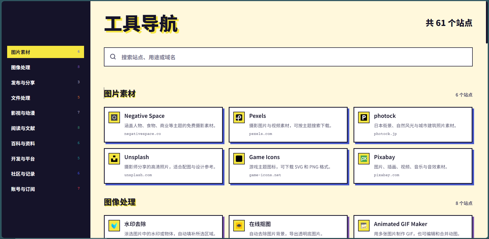

# Toolbox

  

  <strong>工具 · 资源 · 导航</strong> 
  按用途整理的在线工具与资源导航

  
  
  

## 项目简介

Toolbox 是一个以静态网页形式呈现的在线工具与资源导航，按图片素材、图像处理、发布与分享、文件处理、影视与动漫、阅读与文献、百科与资料、开发与平台、社区与记录、账号与订阅十个分类整理站点，当前收录 61 个站点。

项目面向日常找工具、找素材、找文献和找平台的场景，打开页面即可使用，无需注册。点击分类目录只定位到对应位置，不会隐藏其他分类；搜索、排序和目录高亮全部在浏览器本地完成。项目不引入构建工具和前端框架，也不依赖后端服务。以下说明仅涵盖 Toolbox 当前公开提供的内容。

## 功能概览

- 分类导航：十个分类覆盖素材、图像处理、发布、文件、影视、阅读、百科、开发、社区与订阅。
- 站点搜索：按站点名称、站点描述、域名或分类名称实时筛选，并实时显示结果数量。
- 目录定位：点击左侧分类目录滚动到对应分类，其余分类保持可见。
- 滚动联动：页面滚动时以视口高度约 2/5 为界判断当前分类并高亮目录，滚动到底部时高亮最后一个分类。
- 结果提示：搜索无结果时提示更换关键词，不显示空白页面。
- 响应式布局：桌面端使用固定深色侧栏和三列卡片，移动端使用横向目录和单列卡片。
- 内容排序：同一分类内按用途小组连续排列，组内按中文拼音或英文名称排序，页面不显示小组标题。

## 界面预览

  

## 使用方式

### 在线访问

访问 <https://toolbox.krelinnbios.com> 即可，无需注册或安装；推荐使用现代桌面或移动浏览器。

- 在搜索框输入站点名称、用途或域名筛选结果。
- 点击左侧分类（手机上为横向分类栏）跳转到对应分类。
- 向下滚动页面时，左侧目录会自动高亮当前分类。
- 点击站点卡片直接跳转到目标网站。

## 隐私与数据

- Toolbox 是纯静态网页，不收集用户数据，也不要求注册账号。
- 所有站点链接直接跳转到目标网站，不经过中间服务器。
- 搜索、排序和目录定位在浏览器本地完成，关键词不会发送到任何服务。
- 站点图标通过 Google 图标服务加载，图标请求会向该服务发送目标域名；加载失败时显示名称首字。

## 内容边界

- 本项目为公共工具导航站，收录的站点与作者无隶属关系。
- 站点描述使用简短中文，仅说明各站点的主要用途。
- 站点可用性和服务质量由各站点运营方负责，本项目只提供导航链接。
- “账号与订阅”中的部分链接包含注册或推广参数，使用前请自行确认服务内容、价格和适用条款。
- 使用第三方站点时，请遵守对应站点的服务条款和使用规范。

## 许可协议

本项目代码和项目自有文档依据 [MIT License](./LICENSE) 发布，允许使用、修改、分发和商业使用，但须保留许可证与版权声明。

收录的第三方站点、名称、图标、服务和内容不因被本项目链接而自动纳入 MIT License，各站点适用其自身条款和权利声明。

## 反馈与贡献

欢迎通过 [GitHub Issue](https://github.com/KrelinnBios/Toolbox/issues) 提交问题、建议新增站点或改进导航体验。
